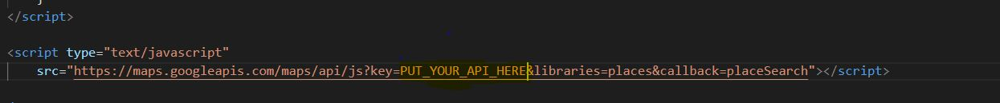

# Angularjs-to-MongoDB

To Connect Angularjs with MongoDB , I have used Nodejs as a server side language.  The following project is a perfect example of inserting data into MongoDB using Angularjs.

I have also made the video on how to use project :- https://www.youtube.com/watch?v=2kwsCqVLPe4

	Steps to be followed:-

1.Since our Project is based on Google location api. You have to put your api credientals. 
Go to client/index.html 
Scroll Down to
 
   
<strong>and put your api key on PUT_YOUR_API_HERE</strong> 

  

2.Open the command line in the project directory.  
3. Since I haven't included the node_modules in github. You have to import it Using :- 
<strong>  npm init </strong> 
(it will install all the dependencies)  
4. Since we are using MongoDB as database make sure to connect it.  
5. After the connection simply execute 
 <strong> node app.js</strong>  
6. Visit 
   http://localhost:3000/		  
7. Add locations and then check your Database.
